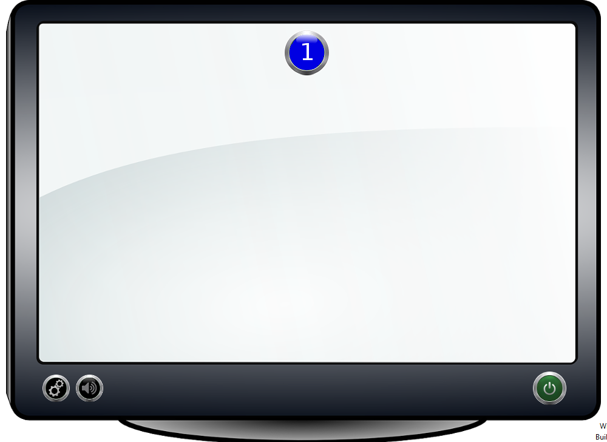
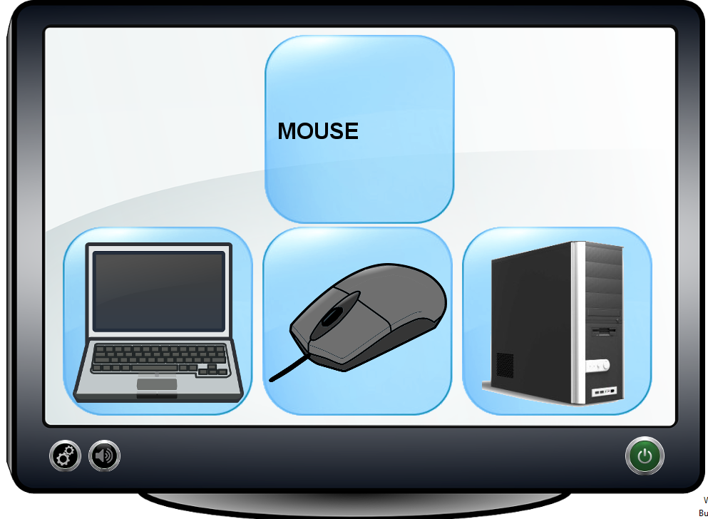

# This is a prototype of a serious game.

## Requirements

This prototype requires Java 7 onward.

## Introduction

This is a prototype of a serious game created to help child learn the names of the computer components and the basic of programming(Not implemented).

## Prototype

* The user can chose the level of it, current there is only one level.

* The game consist in a drag-and-drop where the user have to math the required computer component.

